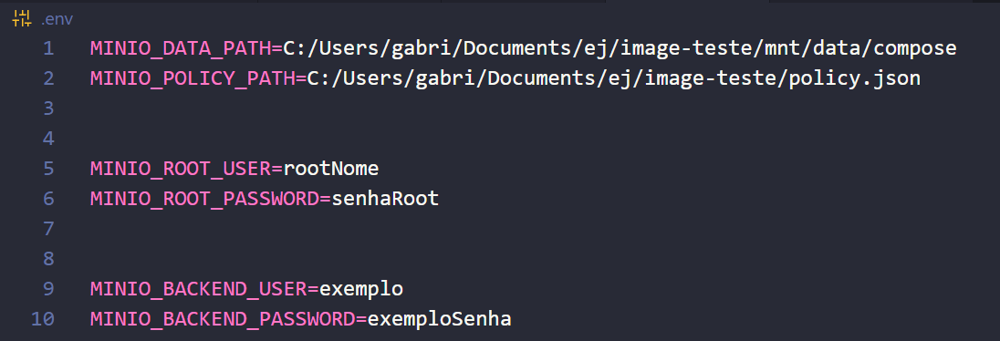

# Documentação Servidor de Imagens (MinIO) - Projeto Daniel

Entenda que este repositório servirá apenas para testes, pois o correto é hospedar esse serviço. 

OBS: Não encontrei uma hospedagem gratuita que ofereça Persistent Disk.


## Tecnologias Usadas
Foi necessário apenas o `docker` e o `docker-compose`, pois esse repositório consiste basicamente do serviço MinIO rodando em um docker.

## Funcionamento
A ideia é que o serviço do MinIO rode em um docker, mas salve todas as imagens no computador host (ou seja, no SEU computador), com caminho especificado pela variável de ambiente **MINIO_DATA_PATH**.

## Pré-requisitos
- Baixar o `docker` e garantir que o `docker-compose` está presente.

- Possuir um `.env` com as seguintes variáveis de ambientes:

    1. **MINIO_DATA_PATH**: Ele conterá o caminho absoluto para a pasta, do SEU computador, em que os dados ficarão salvos;

    2. **MINIO_ROOT_USER**: Nome do usuário ROOT para acessar o MinIO Web UI. OBS: Se encontra em http://localhost:9001

    2. **MINIO_ROOT_PASSWORD**: Senha do usuário ROOT para acessar o MinIO Web UI. OBS: Se encontra em http://localhost:9001
    
Ex:


## Instruções para rodar

Vá para a pasta principal desse projeto e rode no terminal:

```
docker-compose up
```

OU 

Caso queira o terminal livre, utiize a flag `-d`:
```
docker-compose up -d
```
Note que ao user essa flag, o container irá rodar em background em seu computador. Para parar o serviço utilize o comando:

```
docker-compose stop
```